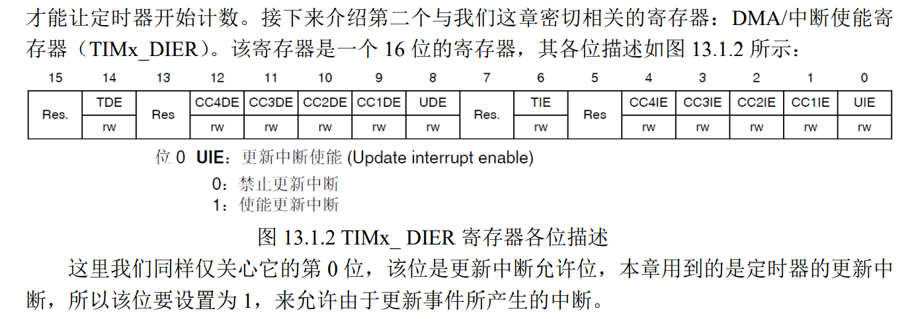

<!--
 * @Author: 睦疏 
 * @Date: 2022-10-29 15:08:18
 * @LastEditors: 睦疏
 * @LastEditTime: 2022-11-21 20:50:56
 * @FilePath: \硬件组学习\代码学习.md
 * @Description: 
 * 
 * Copyright (c) 2022 by YTL2814454117 2814454117@qq.com, All Rights Reserved. 
-->
# GPIO配置
## GPIO 简介
>每个通用 I/O 端口包括 4 个 32 位**配置寄存器**（GPIOx_MODER、GPIOx_OTYPER、
GPIOx_OSPEEDR 和 GPIOx_PUPDR）、2 个 32 位**数据寄存器**（GPIOx_IDR 和
GPIOx_ODR）、1 个 32 **位置位/复位寄存器** (GPIOx_BSRR)、1 个 32 **位锁定寄存器**
(GPIOx_LCKR) 和 2 个 32 **位复用功能选择寄存器**（GPIOx_AFRH 和 GPIOx_AFRL）。

## GPIO 主要特性
>● 受控 I/O 多达 16 个
● 输出状态：推挽或开漏 + 上拉/下拉
● 从**输出数据寄存器** (GPIOx_ODR) 或**外设**（复用功能输出）输出数据
● 可为每个 I/O 选择不同的速度
● 输入状态：浮空、上拉/下拉、模拟
● 将数据输入到输入数据寄存器 (GPIOx_IDR) 或外设（复用功能输入）
● 置位和复位寄存器 (GPIOx_BSRR)，对 GPIOx_ODR 具有按位写权限
● 锁定机制 (GPIOx_LCKR)，可冻结 I/O 配置
● 模拟功能
● 复用功能输入/输出选择寄存器（一个 I/O 最多可具有 16 个复用功能）
● 快速翻转，每次翻转最快只需要两个时钟周期
● 引脚复用非常灵活，允许将 I/O 引脚用作 GPIO 或多种外设功能中的一种

# 定时器
## 寄存器
>1. 控制寄存器 1（TIMx_CR1）

>2. DMA/中断使能寄存器（TIMx_DIER）

>3. 预分频寄存器（TIMX_PSC）

>4. 自动重装载寄存器（TIMX_ARR）

>5. 定时器状态寄存器（TIM_SR）

# API
