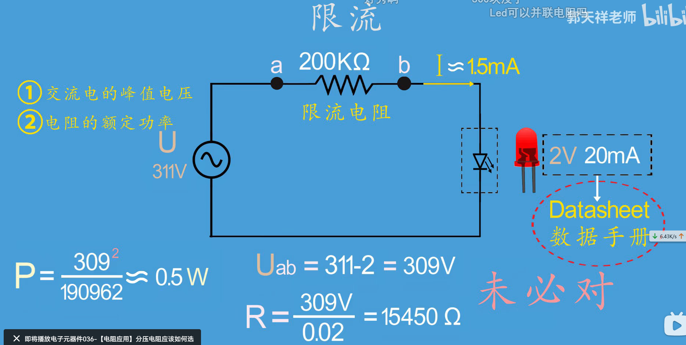
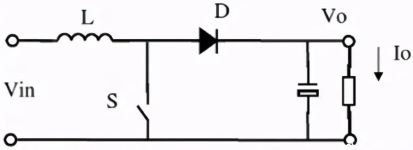

<!--
 * @Author: 睦疏 
 * @Date: 2022-08-19 14:28:39
 * @LastEditors: 睦疏
 * @LastEditTime: 2022-09-22 20:30:50
 * @FilePath: \硬件组学习\元件参数与选型.md
 * @Description: 
 * 
 * Copyright (c) 2022 by YTL2814454117 2814454117@qq.com, All Rights Reserved. 
-->
# 电阻
1. 分类：直插 贴片 印刷电阻
2. 参数：精度 温度系数 功率
温度系数：单位PPM 尽量选小的
功率：**打折 留有余地**

# 贴片电阻命名规则
> 最后一位数字是10的幂
> R代表小数点

> 前2位是数字代表乘数（需要查EIAJ表）
> 后1位是字母代表幂(需要查EIAJ表)

>**0欧姆电阻的作用**
一、0欧电阻的**定义**：
零欧姆电阻又称为**跨接电阻器**，是一种特殊用途的电阻。
其实零欧姆电阻的阻值并非真的为零，而是一个**实际电阻很小**的电阻。
在电路板设计中两点不能用印刷电路连接，承载正面用跨线连接，这在普通板中经常看到，为了让自动贴片机和自动插件机正常个工作就用零欧姆的电阻代替跨线。
二、0欧电阻的**作用**：
1、在PCB上方便调试或用于兼容设计等原因。
2、作为**跳线**使用、避免用跳针造成的高频干扰。
3、在**高频信号**下充当电感或电容。
4、在数字和模拟等混合电路中，往往要求**两个地分开，并且单点连接**。可以用一个零欧姆电阻来连接两个地，而不是直接连在一起。使地线分成了两个网络，在**大面积铺铜等处理时就会方便得多**。
5、做电路保护，**充当低成本熔丝**（如在USB电路中使用零欧电阻充当USB过流保护）。由于PCB上走线的熔断电流较大，如果发生短路过流等故障时，很难熔断，可能会带来更大的事故。零欧电阻电流承受能力比较弱，当故障发生时零欧电阻会首先熔断，从而保护电路。
6、为电路调试预留的位置，调试时焊接上，可以根据需求决定是否安装，有时会用*来标注。表示由调试时决定。
7、作为**配置电路**使用。作用与跳线或拨码开关类似，都是通过焊接固定上去的，这样就避免了普通用户随意修改位置。通过安装不同位置的电阻，就可以更改电路的功能或者设置地址。

# 限流电阻的选择

# 电容
1. 分类：直插 贴片电容
         有无极性分类
2. 参数：精度 温度系数 耐压（留有余量） 温度范围
        ESR（等效串联电阻）
     温度系数：单位PPM 负相关
3. 常用贴片电容：MLCC：Multi-layer ceramic capacitors
                多层陶瓷电容器
                MLCC：NP0=C0G X7R
        NP0电容器是电容量和介质损耗最稳定的电容器之一

4. 常用极性电容：电解电容 固态电容（二者耐压性好）
    
>直插电容：银边上写有-的为负极
>贴片电解电容：黑边为负

在设计电路的时候，只要用到了芯片，就需要在
此芯片的VCC引脚放置一个0.1μF的陶瓷电容进
行滤波。

>**电容的作用**
1. 降压
2. 滤波
3. 延时
4. 耦合

# 电感
1. 分类：直插 贴片电感（一般有铁芯）
2. 参数主要有：精度 自谐振频率(SRF)
   通流能力(lrms)：电感由于有电阻损耗所以会发热
   在热量不损环电感的情况下，最大允许持续流过的电
   流
   直流电阻(DCR)：电感的直流电阻值，由绕线圈数
   和线的直径决定。，一疲绕电感的线越粗DCR越小，开关
   电源中为了提高效率可以采用DCR比较小的电感
   饱和电流(Isat)：带有磁芯的电感，当电流增大到
   定程度时，磁场强度不再增加，继续增大电流则元件的
    电感量将迅速下降。这个电流称为饱和电流，所以要是带
    磁芯的电感正常工作，不能使电流峰值超过饱和电流。不
    带磁芯的空心电感不存在饱和电流，其磁场随电流增大而
    增大，电感量不变。

3. 命名规则：同电阻 单位为微亨

# 二极管
**单向导电性**
1. 主要参数：
>1.最大整流电流
最大整流电流是指二极管长时间工作时，允许流过二极管的最大正向平
均电流，它由PN结的结面积和散热条件决定。
2.最大反向工作电压UR
它是二极管加反向电压时为防止击穿所取的安全电压，一般将**反向击穿
电压UBR的一半**定为最大反向工作电压UR。
3.反向电流
是指二极管加上最大反向工作电压U时的反向电流。**愈小，二极管
的单向导电性就愈好**。此外，由于反向电流是由少数载流子形成的，所
以，温度对的影响很大
4.最高工作频率fM
fM主要由PN结电容的大小决定，结电容愈大，则fM就越低。若工作频率
超过fM,则二极管的单向导电性就变差，甚至无法使用。
极管主要是利用其单向导电性，通常用于整流、检波、限幅、，元件
>保护等，在数字电路中常作为开关元件。

2. 作用
>单相半波整流电路

>单向桥式整流电路

>滤波电路
将脉动直流电变成较为平滑的直流电，这个过程称为滤波
滤波电路有电容滤波电路和电感滤波电路

>电容滤波电路

>串联二极管防反接

>给电感续流

>限幅

>LED发光是由于特殊的半导体材料在被导通时发出光子

# 三极管
1. 作用:放大电流 开关
2. 分类：NPN型 PNP型
   

>NPN型
原理

>区别

**MOS管**

MOS，是MOSFET的缩写。MOSFET 金属-氧化物半导体场效应晶体管，简称金氧半场效晶体管（Metal-Oxide-Semiconductor Field-Effect Transistor, MOSFET）。
一般是金属(metal)—氧化物(oxide)—半导体(semiconductor)场效应晶体管，或者称是金属—绝缘体(insulator)—半导体。

记住 MOS管有 三个引脚名称：G：gate 栅极；S：source 源极；D：drain 漏极。

>**分类**
按沟道分类，场效应管分为PMOS管（P沟道型）和NMOS（N沟道型）管。
按材料分类，可以分为分为耗尽型和增强型：
增强型管：栅极-源极电压 Vgs 为零时漏极电流也为零；
耗尽型管：栅极-源极电压 Vgs 为零时漏极电流不为零。

# DCDC(开关电源)

**特点**
高效率
**调制方式**
>1、PFM（脉冲频率调制方式）
开关脉冲宽度一定，通过改变脉冲输出的频率，使输出电压达到稳定。PFM控制型即使长时间使用，尤其小负载时具有耗电小的优点。
2、PWM（脉冲宽度调制方式）
开关脉冲的频率一定，通过改变脉冲输出宽度，使输出电压达到稳定。PWM控制型效率高并具有良好的输出电压纹波和噪声。
通常情况下，采用PFM和PWM这两种不同调制方式的DC-DC转换器的性能不同点如下：
PWM的频率，PFM的占空比的选择方法。PWM/PFM转换型小负载时实行PFM控制，且在重负载时自动转换到PWM控制。

**原理架构**
>DC-DC有三种常见的三种原理架构：
1、Buck（降压型DC/DC转换器）

2、Boost（升压型DC/DC转换器）

3、Buck-Boost（升降压型DC/DC转换器）

# 磁珠
>磁珠是一种被动组件，用来抑制电路中的高频噪声。磁珠是一种特别的扼流圈，其成分多半为铁氧体，利用其高频电流产生的热耗散来抑制高频噪声。磁珠有时也称为磁环、EMI滤波器、铁芯等

