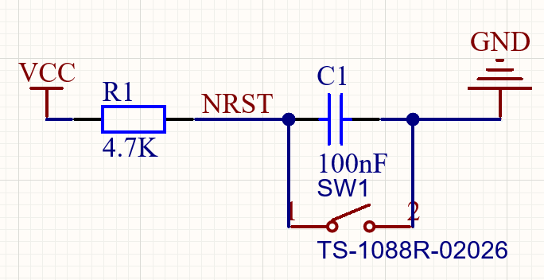
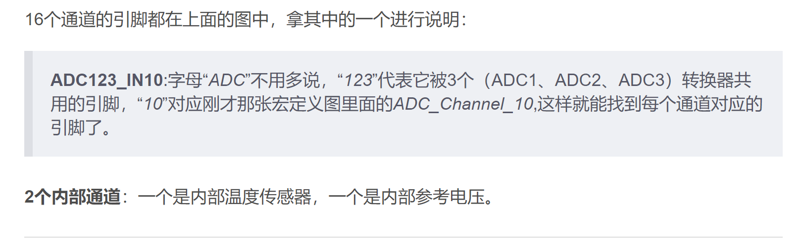
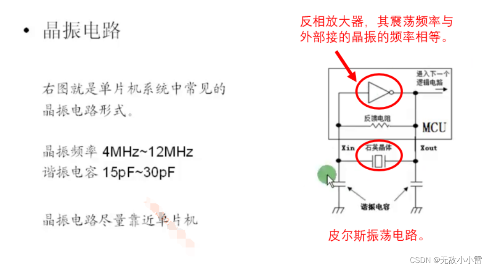

<!--
 * @Author: 睦疏 
 * @Date: 2022-08-28 08:35:35
 * @LastEditors: 睦疏
 * @LastEditTime: 2022-09-07 20:49:23
 * @FilePath: \硬件组学习\板子学习.md
 * @Description: 
 * 
 * Copyright (c) 2022 by YTL2814454117 2814454117@qq.com, All Rights Reserved. 
-->
# 电磁阀控制板
>1. 原理图
主芯片：MC74HC164AD **（八位串转并移位寄存器）**

工作电压范围：2.0 V 至 6.0 V   低输入电流：1 uA
引脚功能：
NRST：低电平异步复位引脚
SCL SDA :**IIC通信总线（串行输入）**
VCC GND ：逻辑电位
QX：**并行输出端口**

>复位模块

电源模块（**TVS稳压管**）

数据输入模块(**IIC通信**)

# 主控顶板
>1. 原理图
主芯片：STM32F405RGT6

## SWD协议

**用来烧录程序**

## BOOT启动模式

## WKUP引脚

## 串口

## ETH(以太网)
>STM32F407xx 器件为以太网 LAN 通信提供符合 IEEE-802.3-2002 标准的媒体访问控制器 (MAC)，通过行业标准的媒体独立接口 (MII) 或简化的媒体独立接口 (RMII)。
STM32F407xx 需要外部物理接口设备 (PHY) 连接到物理 LAN 总线（双绞线、光纤等）。
PHY 使用 17 个 MII 信号或 9 个 RMII 信号连接到 STM32F407xx MII 端口，并且可以使用 STM32F407xx 的 25 MHz (MII) 提供时钟。

## 定时器ETR

**TIM8_BKIN**：故障信号

## ADC通道

## DCMI

## I2S
>它为音频应用而设计，是一种电子的串行总线，用于连接电子音频设备。
它传输的是PCM音频数据（即脉冲编码调制)，PCM音频数据是未经压缩的音频采样数据裸流，它是由模拟信号经过采样、量化、编码转换成的标准数字音频数据。I2S是音频数字化后数据排列的一种格式。

**I2S特点**
>①支持全双工和半双工通信。(单工数据传输只支持数据在一个方向上传输；半双工数据传输允许数据在两个方向上传输，但是在某一时刻，只允许数据在一个方向上传输，它实际上是一种切换方向的单工通信；全双工数据通信允许数据同时在两个方向上传输，因此，全双工通信是两个单工通信方式的结合，它要求发送设备和接收设备都有独立的接收和发送能力。
②支持主/从模式。(主模式：就是主CPU作为主机，向从机（挂载器件）发送接收数据。从模式：就是主CPU作为从机，接收和发送主机（挂载器件）数据。而主从机的分别其实是一个触发的作用，主机主动触发，从机只能被动响应触发。)

**I2S接口**
>I2S总线必须的3个信号线
**(1) SCK: (continuous serial clock) 串行时钟**
串行时钟SCK，也叫位时钟BCLK。对应数字音频的每一位数据，SCK都有1个脉冲。SCK的频率 = 声道数 * 采样频率 * 采样位数。
**(2) WS: (word select) 字段（声道）选择**
字段选择信号WS，也叫LRCLK，用于切换左右声道的数据。WS的频率 = 采样频率。
字段选择信号WS表明了正在被传输的声道。I2S Philips标准WS信号的电平含义如下：
WS为0，表示正在传输的是左声道的数据；
WS为1，表示正在传输的是右声道的数据。
**(3) SD: (serial data) 串行数据**
串行数据SD，就是用二进制补码表示的音频数据。I2S串行数据在传输的时候，由高位(MSB)到低位(LSB)依次进行传输。

## MCO
>时钟输出功能
共有两个微控制器时钟输出 (MCO) 引脚：
 MCO1
用户可通过可配置的预分配器（从 1 到 5）向 MCO1 引脚 (PA8) 输出四个不同的时钟源：
— HSI 时钟
— LSE 时钟
— HSE 时钟
— PLL 时钟
所需的时钟源通过 RCC  时钟配置寄存器 (RCC_CFGR) 中的 MCO1PRE[2:0] 和 MCO1[1:0]
位选择。
 MCO2
用户可通过可配置的预分配器（从 1 到 5）向 MCO2 引脚 (PC9) 输出四个不同的时钟源：
— HSE 时钟
— PLL 时钟
— 系统时钟 (SYSCLK)
— PLLI2S 时钟
所需的时钟源通过 RCC  时钟配置寄存器 (RCC_CFGR) 中的 MCO2PRE[2:0] 和 MCO2
位选择。
对于不同的 MCO 引脚，必须将相应的 GPIO 端口在复用功能模式下进行设置。
MCO 输出时钟不得超过 100 MHz（最大 I/O 速度）。

## 一些不认识的引脚

VPP：编程/擦除电压。

## 晶振电路

**晶振电路在布线的时候，尽量靠近单片机，因为晶振引脚，PCB走线也有电容电阻效应。**

>**晶振为什么要加电容**
　　1、为了要满足谐振的条件。 具体讲就是：晶体元件的负载电容是指在电路中跨接晶体两端的总的外界有效电容。是指晶振要正常震荡所需要的电容。一般外接电容，是为了使晶振两端的等效电容等于或接近负载电容。不是所有晶体振荡电路都需要匹配电容。是否需要由振荡电路的形式决定，分析时需采用晶体的等效模型。
　　2、接地：晶体旁边的两个电容接地， 实际上就是电容三点式电路的分压电容， 接地点就是分压点。 以接地点即分压点为参考点， 振荡引脚的输入和输出是反相的， 但从并联谐振回路即石英晶体两端来看， 形成一个正反馈以保证电路持续振荡
　　当然，你也可以这样理解：
　　晶振的标称值在测试时有一个“负载电容”的条件，在工作时满足这个条件，振荡频率才与标称值一致，也就是说，只有连接合适的电容才能满足晶振的起振要求，晶振才能正常工作。

## LDO 
特点：成本低，噪音低，静态电流小，这些是它的突出优点。它需要的外接元件也很少，通常只需要一两个旁路电容

缺点：（1）只能降压，不能升压。
    （2）效率低，特别是输入电压高的情况下，一般负载电流小于1A情况下使用

## DCDC(开关电源)
**调制方式**
>1、PFM（脉冲频率调制方式）
开关脉冲宽度一定，通过改变脉冲输出的频率，使输出电压达到稳定。PFM控制型即使长时间使用，尤其小负载时具有耗电小的优点。
2、PWM（脉冲宽度调制方式）
开关脉冲的频率一定，通过改变脉冲输出宽度，使输出电压达到稳定。PWM控制型效率高并具有良好的输出电压纹波和噪声。
通常情况下，采用PFM和PWM这两种不同调制方式的DC-DC转换器的性能不同点如下：
PWM的频率，PFM的占空比的选择方法。PWM/PFM转换型小负载时实行PFM控制，且在重负载时自动转换到PWM控制。

**原理架构**
>DC-DC有三种常见的三种原理架构：
1、Buck（降压型DC/DC转换器）

2、Boost（升压型DC/DC转换器）

3、Buck-Boost（升降压型DC/DC转换器）

# DT ADC采样板
## 仪表放大器

## ADC转换芯片

