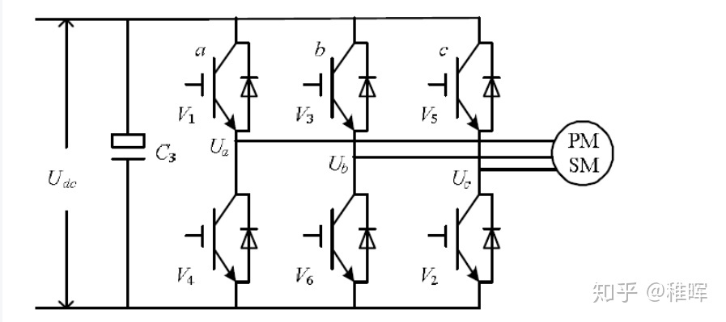
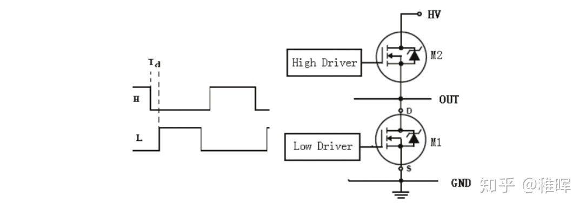
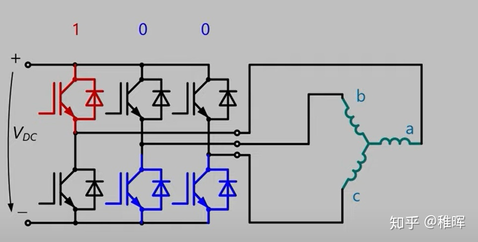
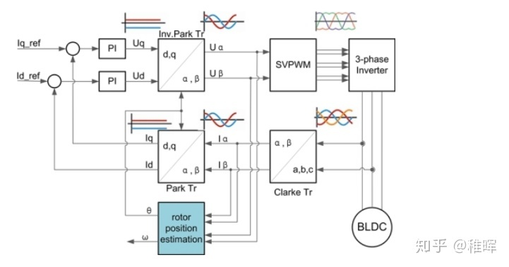
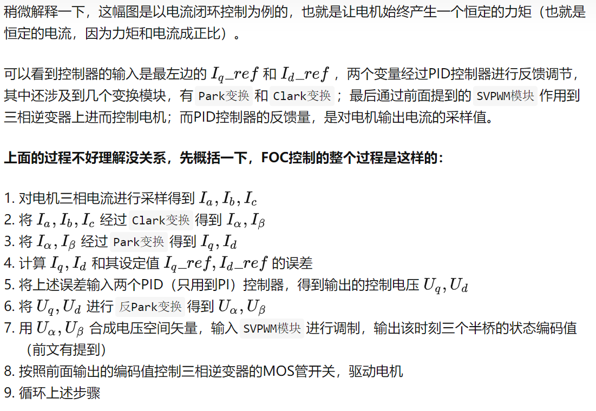
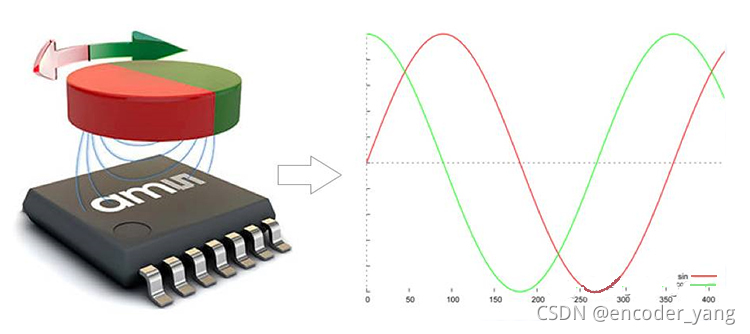
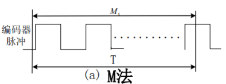
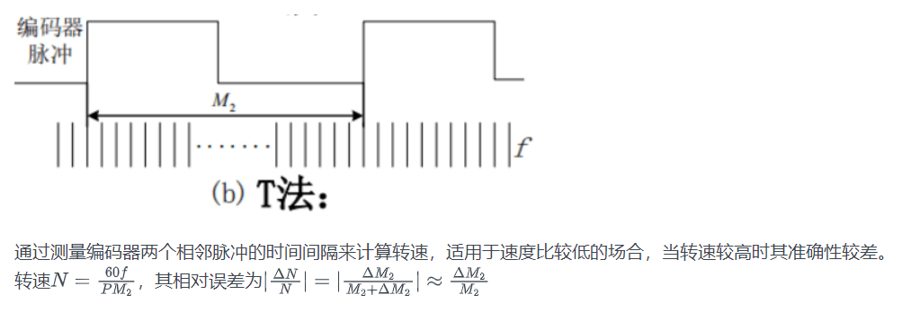
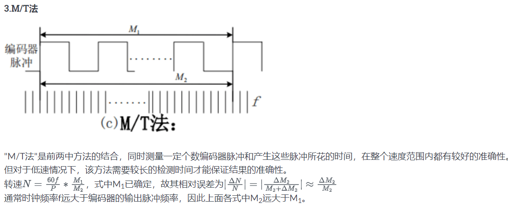

<!--
 * @Author: 睦疏 
 * @Date: 2022-09-16 15:49:45
 * @LastEditors: 睦疏
 * @LastEditTime: 2022-11-03 22:34:02
 * @FilePath: \硬件组学习\电机.md
 * @Description: 
 * 
 * Copyright (c) 2022 by YTL2814454117 2814454117@qq.com, All Rights Reserved. 
-->
# FOC
>FOC（Field-Oriented Control），直译是磁场定向控制，也被称作矢量控制（VC，Vector Control），是目前无刷直流电机（BLDC）和永磁同步电机（PMSM）高效控制的最优方法之一。FOC旨在通过精确地控制磁场大小与方向，使得电机的运动转矩平稳、噪声小、效率高，并且具有高速的动态响应。

 **FOC驱动器和无刷电调的区别**
>**FOC的优势：**
**低转速下控制**
由于控制原理的区别，无刷电调只能控制电机工作在高转速下，低速下很难控制；而FOC控制器则完全没有这个限制，不论在什么转速下都可以实现精确控制。
**电机换向**
同上面的理由，由于**无感电调无法反馈转子位置，**因此很难实现电机正反转的换向；而FOC驱动器的换向性能极其优秀，最高转速下正反转切换可以非常顺畅；此外FOC还可以以**能量回收**的形式进行刹车控制。
**力矩控制**
普通电调都只能控制电机转速，而FOC可以进行电流（力矩）、速度、位置三个闭环控制。
**噪音**
FOC驱动器的噪音会比电调小很多，原因是普通电调采用方波驱动，而FOC是正弦波。

>**电调的优势：**
**兼容性**
电调驱动不同的BLDC不需要进行参数整定，而FOC需要。
**算法复杂度**
电调的算法实现更简单，运算量少，很适合需要提高带宽的超高转速电机。
**成本**
电调的成本比FOC低很多。

>**换向**的操作，就是需要**驱动器**去完成的。
这也是无刷电机和有刷电机最大的区别，即不像**有刷电机的机械换向**，无刷电机是通过**电子换向**来驱动转子不断地转动，电机的电压和KV值决定了电机转速，而电机的转速就决定了换向的频率。
至于什么时候怎么知道该换到哪个供电相？如何产生更平滑的换向电压？如何提高电源的利用效率？这些都是FOC控制方法要探讨和解决的问题。

**关于KV值**
>电机KV值：**电机的转速（空载）=KV值X电压**；例如KV1000的电机在10V电压下它的转速（空载）就是10000转/分钟。
对于同种尺寸规格的无刷来说：
绕线匝数多的电机，KV值低，最高输出电流小，但扭力大；
绕线匝数少的电机，KV值高，最高输出电流大，但扭力小；

关于BLDC和PMSM的区别
无刷电机其实可以分为无刷直流电机（BLDC，我们航模上都是用这种）和永磁同步电机（PMSM），结构大同小异，主要区别在于制造方式（线圈绕组方式）不同导致的一些特性差异（比如反电动势的波形）。
从上面分析的无刷电机模型其实可以看到，**由于转子在磁场中只有6个稳定的状态，因此旋转过程其实是不平滑的**，存在扭矩的抖动（没有通电的时候可以用手转一下无刷电机，会感受到这种“颗粒感”）。因此为了解决这个问题，从“硬件”和从“软件”出发有两个解决方案，这就衍生出了BLDC和PMSM的区别。

简单地说，BLDC由于**反电动势接近梯形波**，所以肯定是会有上面说的抖动问题的，但是转一圈抖6下太明显了，如果我**增加电机槽、极对数**（也就是磁铁对数），那以前是360度里面抖6下，现在变成120度里面抖6下，甚至更小，这样“颗粒感”不就变得更小了嘛？实际中买到的BLDC电机基本都是多极对的（比如下图），原理跟之前的分析是一样的，出来的都是三相信号（图中的三根线），可以自己进行类推。BLDC也可以结合抗齿槽算法的FOC进行力矩补偿实现平滑控制。

为什么我们非得用方波这种不平滑的波来驱动电机呢，用正弦波它不香吗？是的，这就是PMSM解决问题的方式，由于**PMSM的反电动势被设计为正弦波的形状，我们用软件和算法结合PWM技术将方波转变成等效的SPWM正弦波或者SVPWM马鞍波，再来驱动电机**，结果美滋滋，控制效果很理想。当然为了产生更好的波形、更好的旋转磁场，驱动器、控制算法就变得非常复杂，这也是FOC的实现原理

 驱动电路实现
无刷电机的驱动电路主要使用三相逆变电路来实现，如下图:

所谓逆变电路，即把直流电变换为交流电，或者简单点说就是一个可以产生不同电流流向的电路，通过前面的电机模型分析我们也可以看出，对于无刷电机的驱动是需要在不同时刻施加不同方向的电压（电流）的，因此需要逆变电路。
而逆变电路具体的实现则一般是采用半桥MOS电路来制作的。半桥电路的原型如下，其实很简单，就是两个MOS管组成的上桥臂和下桥臂，中间引出一条输出线：

用3个半桥电路就可以组合成三相逆变电路，每个半桥引出的一根输出线跟无刷电机的一根相线相连，就完成了最基本的无刷驱动电路。
原理方面，MOS管可以看作电压控制的高速电子开关，在MOS管的栅极（上图中的High Drive和Low Drive）施加高电平或者低电平，就可以控制MOS源极和漏极的导通或者关闭。比如在下图中，我们打开第一组半桥的上桥臂、第二组和第三组半桥的下桥臂（其余的关闭），那么就可以让电流从电源正极流过电机的a相，流经b、c相，然后回到电源负极：

 **FOC算法的Pipeline**

# 驱动器
# 磁编码器

as5047u
mt6825

## 原理
**磁编码器工作原理：**
>**霍尔效应**：当电流通过一个位于磁场中的导体的时候，磁场会对导体中的电子产生一个垂直于电子运动方向上的的作用力，从而在垂直于导体与磁感线的方向上产生**电势差**。

如果让施加在这个导体上的磁场以**电流流经路径为轴线**，按照上图箭头所示的方向旋转，那么这个霍尔电势差就会因为磁场与导体之间角度的改变而发生变化，而这个电势差的变化趋势，与之前一文中次级线圈旋转时的输出电压一样，是一条**正弦曲线**。因此，**基于这个通电导体两侧的电压，就可以反推计算出磁场旋转的角度了**。

这就是磁编码器测量旋转位置反馈时的基本工作机理了。测量的旋转位置通过霍尔传感器进行放大和转化。
磁性编码器上用的霍尔传感器（芯片），一般都有着极高的集成度，不仅将霍尔半导体元件和相关的信号处理和调节电路整合在一起，同时还可以集成各种不同类型的信号输出模块，例如：正余弦模拟量信号、方波数字电平信号或者总线通讯输出单元。

## 分类：
>旋转编码器可分为**绝对型（absolute）编码器**及**增量型（incremental）编码器**两种。增量型编码器也称作相对型编码器（relative encoder），利用**检测脉冲**的方式来计算转速及位置[1]，可输出有关旋转轴运动的信息，一般会由其他设备或电路进一步转换为速度、距离、每分钟转速或位置的信息。绝对型编码器会输出**旋转轴的位置**，可视为一种角度传感器。

## 功能：
### 测距
>
### 测速
>**M法**

.png)
**T法**

**M/F法**

### 测加速度
加速度测量可以直接使用进行计算，但这样误差较大，可以用多个速度点先进行最小二乘法拟合直线再计算斜率

