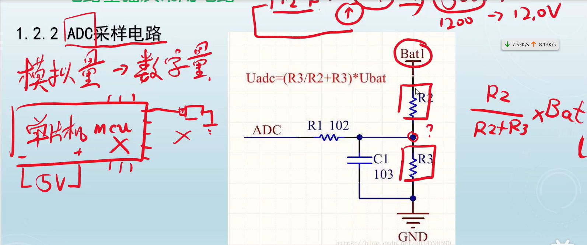
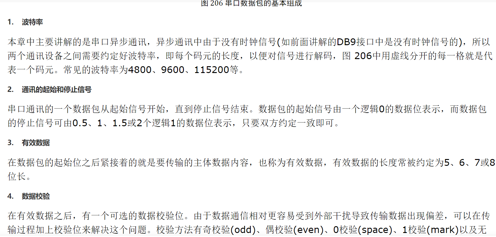
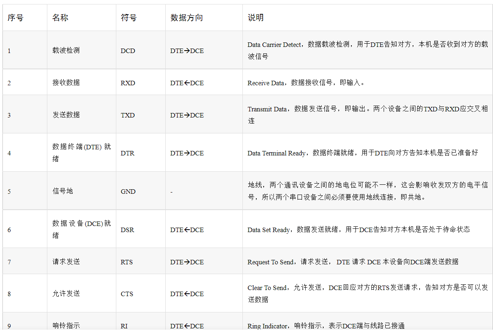

<!--
 * @Author: 睦疏 
 * @Date: 2022-08-25 08:59:45
 * @LastEditors: 睦疏
 * @LastEditTime: 2023-03-07 16:08:47
 * @FilePath: \硬件组学习\电路与通信.md
 * @Description: 
 * 
 * Copyright (c) 2022 by YTL2814454117 2814454117@qq.com, All Rights Reserved. 
-->
# ADC采样电路

>STM32F的**NRST**是异步复位脚。 当NRST输入**低电平**的时候,MCU处于复位状态,重设所有的**内部寄存器,及片内几十KB的SRAM**。 当NRST从低电平变高时,PC指针从0开始。 但是复位的时候不会将STM32F片内RTC的寄存器以及后备存储器重置,因为它们是用电池通过专门的**VBAT**脚供电。

>电源缩写

# 时序逻辑电路：

>时序逻辑电路又称时序电路,主要由**存储电路和组合逻辑电路**两部分组成。它和我们熟悉的其他电路不同,其在任何一个时刻的输出状态由当时的**输入信号和电路原来的状态**共同决定,而它的状态主要是由**存储电路**来记忆和表示的。相当于在组合逻辑的**输入端**加上了一个**反馈输入**，在其电路中有一个存储电路，其可以将输出的状态保持住

>时序逻辑电路应用很广泛,根据所要求的逻辑功能不同进行划分,它的种类也比较繁多。在具体的授课环节中,主要选取了应用较广、具有典型时序逻辑电路特征的三种逻辑器件进行比较详细地介绍[1]。
1.计数器
一般来说,计数器主要由**触发器**组成,用以统计输入计数脉冲CP的个数。计数器的输出通常为现态的函数。计数器累计输入脉冲的最大数目称为计数器的“模”,用M表示。如M=6计数器,又称六进制计数器。所以,计数器的“模”实际上为电路的有效状态数[1]。
同步七进制加法计数器的逻辑图计数器的种类很多,特点各异。主要分类如下:按计数进制可分为:二进制计数器、十进制计数器、任意进制计数器。按计数增减可分为:加法计数器、减法计数器、加/减计数器,又称可逆计数器。按计数器中触发器翻转是否同步可分为:异步计数器和同步计数器[1]。

>2.寄存器
寄存器是存放数码、运算结果或指令的电路,移位寄存器不但可存放数码,而且在移位脉冲作用下,寄存器中的数码可根据需要向左或向右移位。寄存器和移位寄存器是数字系统和计算机中常用的基本逻辑部件,应用很广。一个触发器可存储一位二进制代码, n个触发器可存储n位二进制代码。因此,触发器是寄存器和移位寄存器的重要组成部分。对寄存器中的触发器只要求它们具有置0或者置1功能即可,无论是用同步结构的触发器,还是用主从结构或者边沿触发的触发器,都可以组成寄存器[1]。

>3.顺序脉冲发生器
顺序脉冲是指在每个循环周期内,在时间上按一定先后顺序排列的脉冲信号。产生顺序脉冲信号的电路称为顺序脉冲发生器。在数字系统中,常用以控制某些设备按照事先规定的顺序进行运算或操作

# PID

>**比例控制算法**
我们先说PID中最简单的比例控制，抛开其他两个不谈。还是用一个经典的例子吧。假设我有一个水缸，最终的控制目的是要保证水缸里的水位永远的维持在1米的高度。假设初试时刻，水缸里的水位是0.2米，那么当前时刻的水位和目标水位之间是存在一个误差的error，且error为0.8.这个时候，假设旁边站着一个人，这个人通过往缸里加水的方式来控制水位。如果单纯的用比例控制算法，就是指加入的水量u和误差error是成正比的。即
u=kp*error
假设kp取0.5，
那么t=1时（表示第1次加水，也就是第一次对系统施加控制），那么u=0.5*0.8=0.4，所以这一次加入的水量会使水位在0.2的基础上上升0.4，达到0.6.
接着，t=2时刻（第2次施加控制），当前水位是0.6，所以error是0.4。u=0.5*0.4=0.2，会使水位再次上升0.2，达到0.8.
如此这么循环下去，就是比例控制算法的运行方法。
可以看到，最终水位会达到我们需要的1米。
但是，单单的比例控制存在着一些不足，其中一点就是 –稳态误差！（我也是看了很多，并且想了好久才想通什么是稳态误差以及为什么有稳态误差）。
像上述的例子，根据kp取值不同，系统最后都会达到1米，不会有稳态误差。但是，考虑另外一种情况，假设这个水缸在加水的过程中，存在漏水的情况，假设每次加水的过程，都会漏掉0.1米高度的水。仍然假设kp取0.5，那么会存在着某种情况，假设经过几次加水，水缸中的水位到0.8时，水位将不会再变换！！！因为，水位为0.8，则误差error=0.2. 所以每次往水缸中加水的量为u=0.5*0.2=0.1.同时，每次加水缸里又会流出去0.1米的水！！！加入的水和流出的水相抵消，水位将不再变化！！
也就是说，**我的目标是1米，但是最后系统达到0.8米的水位就不在变化了，且系统已经达到稳定。由此产生的误差就是稳态误差了。**
（在实际情况中，这种类似水缸漏水的情况往往更加常见，比如控制汽车运动，**摩擦阻力就相当于是“漏水”，控制机械臂、无人机的飞行，各类阻力和消耗都可以理解为本例中的“漏水”**）
所以，单独的比例控制，在很多时候并不能满足要求。

>**积分控制算法**
还是用上面的例子，如果仅仅用比例，可以发现存在暂态误差，最后的水位就卡在0.8了。于是，在控制中，我们再引入一个分量，该分量和误差的积分是正比关系。所以，比例+积分控制算法为：
u=kp*error+ ki∗∫∗∫error
还是用上面的例子来说明，第一次的误差error是0.8，第二次的误差是0.4，至此，误差的积分（**离散情况下积分其实就是做累加**），∫∫error=0.8+0.4=1.2. 这个时候的控制量，除了比例的那一部分，还有一部分就是一个系数ki乘以这个积分项。由于这个积分项会将前面若干次的误差进行累计，所以**可以很好的消除稳态误差**（假设在仅有比例项的情况下，系统卡在稳态误差了，即上例中的0.8，由于加入了积分项的存在，会让输入增大，从而使得水缸的水位可以大于0.8，渐渐到达目标的1.0.）这就是积分项的作用。

>**微分控制算法**
换一个另外的例子，考虑刹车情况。平稳的驾驶车辆，当发现前面有红灯时，为了使得行车平稳，基本上提前几十米就放松油门并踩刹车了。当车辆离停车线非常近的时候，则使劲踩刹车，使车辆停下来。整个过程可以看做一个加入微分的控制策略。
微分，说白了在离散情况下，**就是error的差值，就是t时刻和t-1时刻error的差，即u=kd**（error（t）-error（t-1）其中的kd是一个系数项。可以看到，在刹车过程中，因为error是越来越小的，所以**这个微分控制项一定是负数**，在控制中加入一个负数项，他存在的作用就是为了防止汽车由于刹车不及时而闯过了线。从常识上可以理解，越是靠近停车线，越是应该注意踩刹车，不能让车过线，所以这个微分项的作用，就可以理解为刹车，当车离停车线很近并且车速还很快时，这个微分项的绝对值（实际上是一个负数）就会很大，从而表示应该用力踩刹车才能让车停下来。
切换到上面给水缸加水的例子，就是当发现水缸里的水快要接近1的时候，加入微分项，可以防止给水缸里的水加到超过1米的高度，**说白了就是减少控制过程中的震荡**。

# 串口通信

# SPI通信
串行外设接口（Serial Peripheral Interface）
>特点：
>1. 同步 串行 全双工
>2. 主从工作方式
>3. 四线控制

SDO(服务数据对象)：MOSI
SDI(数字分量串行接口)：MISO
SCLK:主设备发出的时钟信号
CS/SS:片选信号CS（chip select）或SS(slave select)
从设备使能信号，由主设备控制。

>时序图

>SPI的4种通讯模式

CPOL:时钟极性（Clock Polarity）
CPHA:时钟相位（Clock Phase）

# I2C通信
特点：SDA SCL 数据线和时钟线
串行通信 主从工作方式 N对N的传输方式

# I2C的 **SCL和SDA为什么要上拉**
因为允许把多个I2C总线器件连接到总线上，连接到I2C总线上的器件是漏极开路或集电极开路的，可以实现线与功能。同时，因为接了上拉电阻，在总线空闲期间，SDA和SCL都是高电平，可以防止外部干扰造成误启动I2C总线。
>**上拉电阻**
功能：
1.提高引脚的驱动能力

2.将不确定的信号钳位在高电平

**下拉电阻**
功能：
1.将不确定的信号钳位在低电平

2.同时接入电源后也能将信号钳位在高电平

# 开集输出
如图，开集的意思，就是集电极C一端什么都不接，直接作为输出端口。

如果要用这种电路带一个负载，比如一个LED，必须接一个上拉电阻，就像这样。

当Vin没有电流，Q5断开时，LED亮。当Vin流入电流，Q5导通时，LED灭。
开漏电路，就是把上图中的三极管换成场效应管（MOSFET）。

# 稳压二极管（齐纳二极管）
>
用法：与稳压元器件或电路反接并联

# 肖特基二极管
>

适用于高频 低压 大电流的电路

# 瞬态抑制二极管（TVS）

# 运算放大器
>## 原理
>
输入阻抗高的原因：**使信号更好地输入到运放上**

# 电源滤波电容
>电源滤波原因：直流电源通常有波动

# GPIO推挽输出与开漏输出
https://blog.csdn.net/weixin_44788542/article/details/115303125?ops_request_misc=%257B%2522request%255Fid%2522%253A%2522167843533016782427467351%2522%252C%2522scm%2522%253A%252220140713.130102334..%2522%257D&request_id=167843533016782427467351&biz_id=0&utm_medium=distribute.pc_search_result.none-task-blog-2~all~sobaiduend~default-1-115303125-null-null.142^v73^insert_down2,201^v4^add_ask,239^v2^insert_chatgpt&utm_term=%E6%8E%A8%E6%8C%BD%E8%BE%93%E5%87%BA%E6%A8%A1%E5%BC%8F&spm=1018.2226.3001.4187

# GPIO八种工作方式详解
https://blog.csdn.net/zhuguanlin121/article/details/118489092?ops_request_misc=%257B%2522request%255Fid%2522%253A%2522167843553516800213057054%2522%252C%2522scm%2522%253A%252220140713.130102334..%2522%257D&request_id=167843553516800213057054&biz_id=0&utm_medium=distribute.pc_search_result.none-task-blog-2~all~sobaiduend~default-2-118489092-null-null.142^v73^insert_down2,201^v4^add_ask,239^v2^insert_chatgpt&utm_term=%E6%B5%AE%E7%A9%BA%E8%BE%93%E5%85%A5%E6%A8%A1%E5%BC%8F&spm=1018.2226.3001.4187